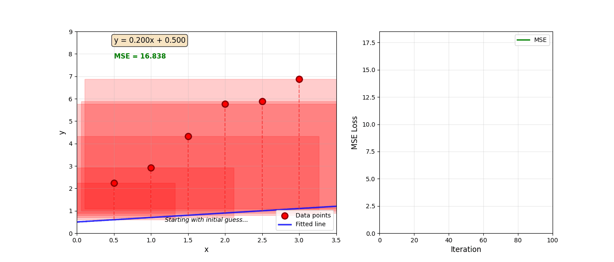
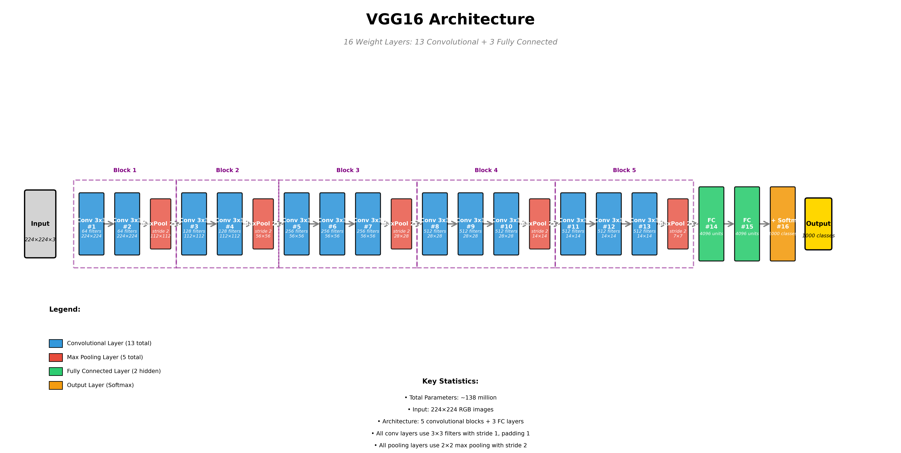
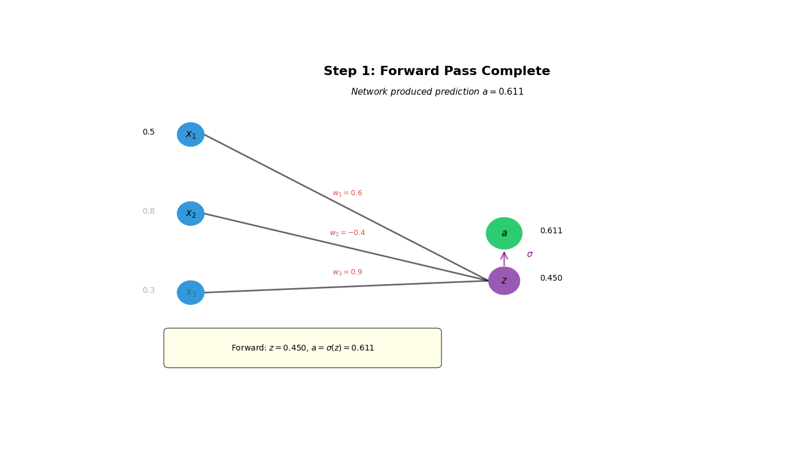
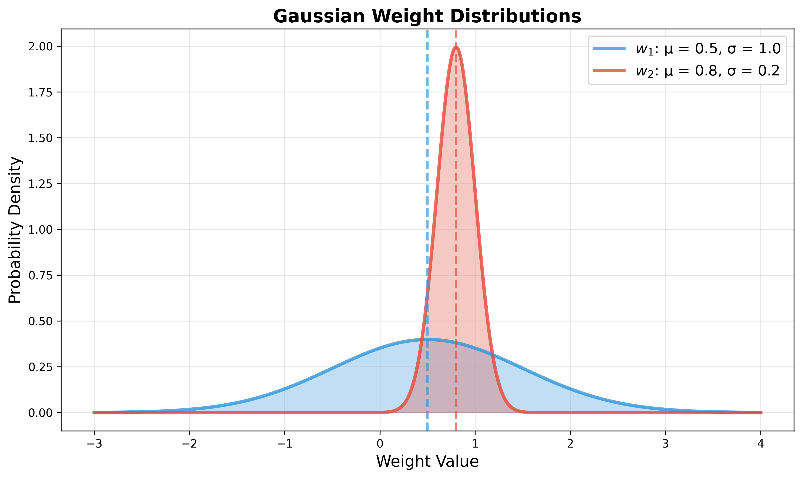
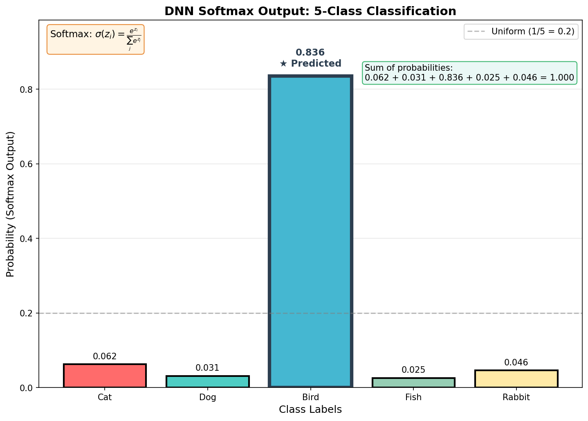

# Learning to Learn - AI and Human Learning
# Part A: What is Artificial Intelligence

**QMUL Lecture**
*24th November 2025*

*Press 'S' for speaker notes • Arrow keys to navigate*

---

## Housekeeping

- Lecture is in two parts, around 45-50minutes long.
- I want to challenge and inspire, not teach all the details.
- If you want more details, there is a repository for code.


Note: Welcome to Part A. In this first hour we'll cover foundational concepts that will be essential for Part B.

---

## Learning Objectives

By the end of Part A, you will be able to:

- Describe what defines machine learning and artificial intelligence
- Understand how "models" are trained.
- Explain how this training limits their abilities
- Describe how these limitations manifest for LLMs.

Note: Welcome to Part A. In this first hour we'll cover foundational concepts that will be essential for Part B.

---

## What is Artificial Intelligence?

<span class="key-term">Artificial Intelligence (AI)</span> is the simulation of human processes by machines, specifically computer systems.

**Examples include:**

- Learning (acquiring information and rules)
- Reasoning (using rules to reach conclusions)
- Self-correction

Note: Start with a broad definition. Ask students what they think AI means before revealing this slide.

---

### The AI Hierarchy


---

## AI Paradigms

<div class="columns">
<div class="column">

### Symbolic AI
("Traditional" AI)

- Rule-based systems
- Logic and reasoning
- Knowledge representation
- Expert systems

</div>
<div class="column">

### Connectionist AI
(Machine Learning)

- Learning from data
- Statistical methods
- Neural networks
- Pattern recognition

</div>
</div>

---

## Machine Learning: Core Concept

<span class="emphasis">Instead of programming rules explicitly, we learn patterns from data</span>

**Traditional Programming:**
```python
def is_spam(email):
    if "winner" in email or "free money" in email:
        return True
    return False
```

**Machine Learning:**
```python
model = train(spam_data, not_spam_data)
prediction = model.predict(new_email)
```

Note: This is a critical distinction. In ML, we don't hand-code the rules.

---

## Comfortable Start - Fitting a straight line.

 - *Collect some data*
 - *Need to know the **gradient** and **intercept***
 - *Fit a line $y = mx + c$ to it*

---

## Comfortable Start - Fitting a straight line.



Note: The "loss function" here is the mean squared error, or MSE. When we use this loss function
we find a unique minimum.

---

## Neural Networks: Basics

<div class="columns">
<div class="column">

**Biological "Inspiration":**
- Neurons receive signals
- Process information
- Send output to other neurons

</div>
<div class="column">

**Artificial Neurons:**
- Receive inputs $x_i$
- Apply weights $w_i$
- Sum: $z = \sum w_i x_i + b$
- Activate: $a = f(z)$

</div>
</div>

$$\text{output} = f\left(\sum_{i=1}^{n} w_i x_i + b\right)$$

Note: The activation function f introduces non-linearity, allowing networks to learn complex patterns.

---

## What do "real" networks look like?



Note: **Properties:**
- Many stacked layers
- Lower layers - simple features.
- Top layers - complex forms.

---

## The Learning Process

1. **Initialize:** Start with random weights
2. **Forward Pass:** Make predictions
3. **Calculate Loss:** How wrong are we?
4. **Backward Pass:** Compute gradients
5. **Update:** Adjust weights to reduce loss
6. **Repeat:** Until convergence

This is <span class="key-term">gradient descent</span> or <span class="key-term">backpropagation</span>!

Note: If you get lost, go back to $y=mx+c$.

---

## What does the prediction process look like?


---

## Loss function?
*Define a "loss" function - measure of how wrong a prediction is*

<span class="key-term">
$$ L = g(\tilde{y}, y)$$
</span>

- Predicted labels $\tilde{y}$ - from model.
- True labels $y$ - from ground truth

Note: The loss function is a *choice*! Different loss functions will give us very different solutions.

---

## Loss function?
*Define a "loss" function - measure of how wrong a prediction is*

<span class="key-term">
$$ L = g(\tilde{y}, y)$$
</span>

**Properties**
 - Differentiable.
 - Non-negative, and 0 for perfect prediction.
 - Reflects severity of different types of errors.

---

## What does learning look like?



Note: The updates to the "weights" of the neural network are usually not the *full* gradient, but rather some small number (the *learning rate*) multiplied by them.
This is to ensure that we converge to a "good" minimum. There is no guarantee now that minima are unique either.

---

## Quick preamble on distributions.

*Gradient descent as we have described gives a **single number** for each weight*
 - Running the same network with the same data will *always* give the same results.
 - We lose information about the training set - we don't know if a parameter was set with one data point or 10k.
 - An alternative would be to learn a *distribution* for each weight.

---

## What does this look like?



---

## What does *a prediction* look like?



---

## Real example.

*To the jupyter notebook*

Note: We will see in the jupyter notebook `notebooks/bayesian_nn_mnist_demo.ipynb` that there are important limitations to how machine learning deals with things it hasn't seen before.

---

## What does the whole process look like?
 - Environment has a process which generates data $(X, y)$ pairs
 - We define a model to make predictions, with parameters $\lambda$
 - We set a loss function to capture what we think is most important $L(y, \hat{y})$
 - Iteratively minimize loss over model parameters $\lambda$ to create model $M$

---

## Process diagram

<div class="mermaid">
graph TB
    subgraph ENV[Environment]
        G[Generative Process] --> D[Data]
    end
    subgraph MOD[Model]
        D --> Split{Data}
        Split --> Predictors[Predictors]
        Split --> Labels[Labels]
        P[Parameters] --> M[Predictions]
        Predictors --> M
        Labels --> L[Loss Function]
        M --> L
        L -->|update parameters| P[Parameters]
    end
    classDef paramClass fill:#e1f5e1,stroke:#4caf50,stroke-width:2px
    classDef lossClass fill:#fff3e0,stroke:#ff9800,stroke-width:2px
    class P,U paramClass
    class M,L lossClass
</div>

---

## Limitations

 - There is no feedback of the model on the generative process.
 - To collect more data, we need to wait for the generative process.
 - There is no real concept of *interaction* - models are trained on static data.

---


## Large Language Models (LLMs)

 - The process is a *little* different.
 - We are not predicting *labels*, but rather next words.
 - There is no real concept of *interaction* - models are trained on static data.
 - The mystery box is the data, not the models.

---

## Key Takeaways: Part A

- AI encompasses multiple approaches and paradigms.
- Machine learning learns patterns from data rather than explicit rules.
- Deep learning is a subset of ML using neural networks, it's really stacks of curve fitting.
- The way in which we acquire data is the fundamental limitation.
- Current AI is very different from how living things learn

**Coming up in Part B:** Living organisms and how they learn.

Note: Take questions before moving to Part B. This is a good break point.

---

## Questions?
