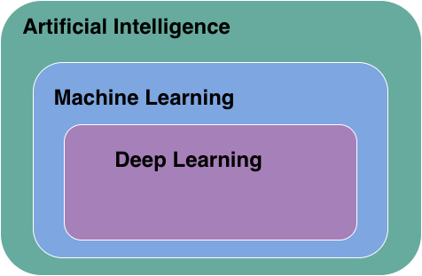
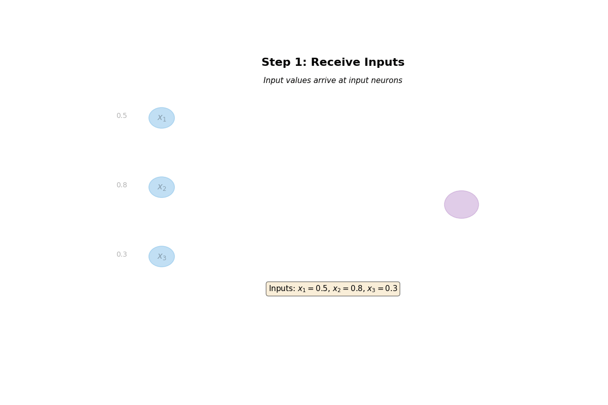

# Learning to Learn - AI in Education
# Part A: What is Artificial Intelligence

**QMUL Lecture**
*24th November 2025*

*Press 'S' for speaker notes • Arrow keys to navigate*

---

## Learning Objectives

By the end of Part A, you will be able to:

- Describe what defines machine learning and artificial intelligence
- Understand how "models" are trained.
- Explain how this training limits their abilities
- Describe how these limitations manifest for LLMs.

Note: Welcome to Part A. In this first hour we'll cover foundational concepts that will be essential for Part B.

---

## What is Artificial Intelligence?

<span class="key-term">Artificial Intelligence (AI)</span> is the simulation of human processes by machines, specifically computer systems.

**Examples include:**

- Learning (acquiring information and rules)
- Reasoning (using rules to reach conclusions)
- Self-correction

Note: Start with a broad definition. Ask students what they think AI means before revealing this slide.

----

### The AI Hierarchy



---

## AI Paradigms

<div class="columns">
<div class="column">

### Symbolic AI
("Traditional" AI)

- Rule-based systems
- Logic and reasoning
- Knowledge representation
- Expert systems

</div>
<div class="column">

### Connectionist AI
(Machine Learning)

- Learning from data
- Statistical methods
- Neural networks
- Pattern recognition

</div>
</div>

---

## Machine Learning: Core Concept

<span class="emphasis">Instead of programming rules explicitly, we learn patterns from data</span>

**Traditional Programming:**
```python
def is_spam(email):
    if "winner" in email or "free money" in email:
        return True
    return False
```

**Machine Learning:**
```python
model = train(spam_data, not_spam_data)
prediction = model.predict(new_email)
```

Note: This is a critical distinction. In ML, we don't hand-code the rules.

----

### The Learning Process

1. **Initialize:** Start with random weights
2. **Forward Pass:** Make predictions
3. **Calculate Loss:** How wrong are we?
4. **Backward Pass:** Compute gradients
5. **Update:** Adjust weights to reduce loss
6. **Repeat:** Until convergence

This is <span class="key-term">gradient descent</span>!

---

## Neural Networks: Basics

<div class="columns">
<div class="column">

**Biological "Inspiration":**
- Neurons receive signals
- Process information
- Send output to other neurons

</div>
<div class="column">

**Artificial Neurons:**
- Receive inputs $x_i$
- Apply weights $w_i$
- Sum: $z = \sum w_i x_i + b$
- Activate: $a = f(z)$

</div>
</div>

$$\text{output} = f\left(\sum_{i=1}^{n} w_i x_i + b\right)$$

Note: The activation function f introduces non-linearity, allowing networks to learn complex patterns.

---

## What do these things look like?



---

## Training process?

*Define a "loss" function - measure of how wrong a prediction is*

$$ L = g()$$

Note: The activation function f introduces non-linearity, allowing networks to learn complex patterns.

---

## Key Takeaways: Part A

- AI encompasses multiple approaches and paradigms
- Machine learning learns patterns from data rather than explicit rules
- Deep learning is a subset of ML using neural networks
- Modern success requires: data, computation, and algorithms
- Understanding the fundamentals is crucial for advanced topics

**Coming up in Part B:** Practical applications and modern architectures

Note: Take questions before moving to Part B. This is a good break point.

---

## Questions?

<div style="margin-top: 2em; font-size: 0.9em;">

**Resources:**
- Course repository: github.com/chrispedder/QMUL-Lecture

</div>
