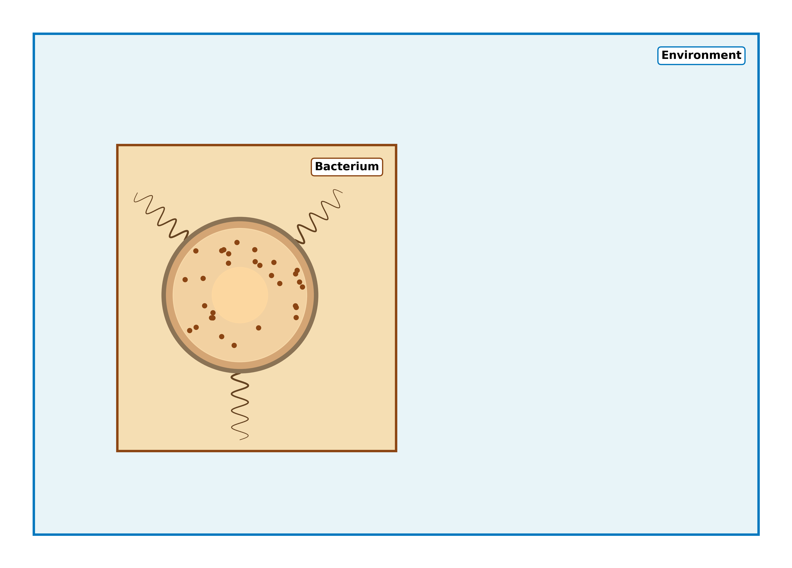

# Part B: How living things learn

**A possible theory**

---

## Agenda: Part B

- What is life?
- The Free Energy Principle
- How Do We Learn?
- Where Does This Matter?
- Future Directions.

Note: Part B contrasts strongly with the foundations from Part A, and is more speculative.

---

### Defintion of Life.

**Question:** How do we define what it is to be alive?

- M
- R
- S
- G
- R
- E
- N

Note: I am getting on a bit, but this was the mnemonic I was taught in school!

---

### Defintion of Life.

**Question:** How do we define what it is to be alive?

- Movement
- Respiration
- Sensitivity
- Growth
- Resproduction
- Excretion
- Nutrition

---

### Defintion of Life.

**Question:** Is this useful?

- Movement - plants, fungi, barnacles?
- Respiration - clostridium bacteria?
- Sensitivity - viruses?
- Growth
- Resproduction - worker ants, worker bees?
- Excretion
- Nutrition - mayflies?

---

### Better defintion?

A living thing is an object which *actively maintains* its *boundary* with its environment

**Key points:**
- Actively - it uses energy to do this.
- Boundary - a border we can draw that separates organism and environment. These interact only through *sensory* and *active* states through the boundary.

---

### Example: Bacterium

---

## Summary: Parts A & B

**Part A - AI Foundations:**
- AI, ML, and Deep Learning hierarchy.
- Where modern AI is weak.
- There are some fixes, but the problem isn't well-posed.

**Part B - Natural Learning:**
- Living things maintain a boundary.
- Free energy principle - minimize surprisal.
- Model building, exploration vs exploitation.
- Occam's razor, the scientific method, how to teach.
- New models.

You now have the foundations to revolutionize AI!

---

## Thank You!

### Questions & Discussion

**Stay Connected:**
- 📧 Email: [chrisjbpedder@hey.com]
- 💻 GitHub: [github.com/chrispedder/QMUL-Lecture]

Slides created with Reveal.js • Press 'S' for speaker notes • Press '?' for keyboard shortcuts

