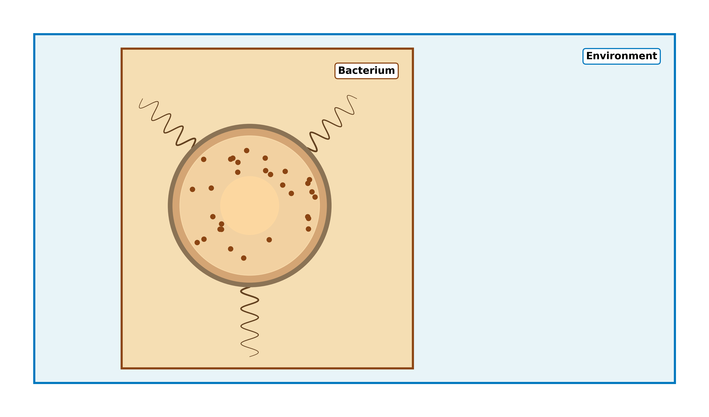
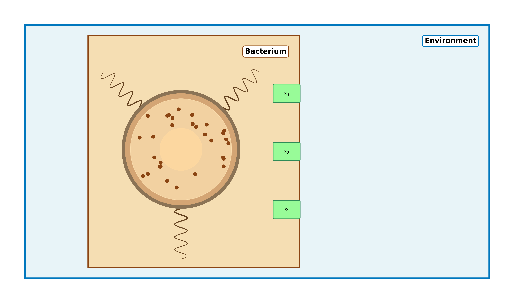
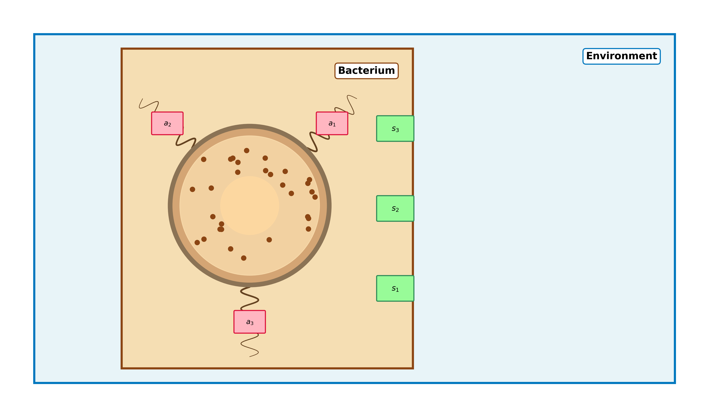
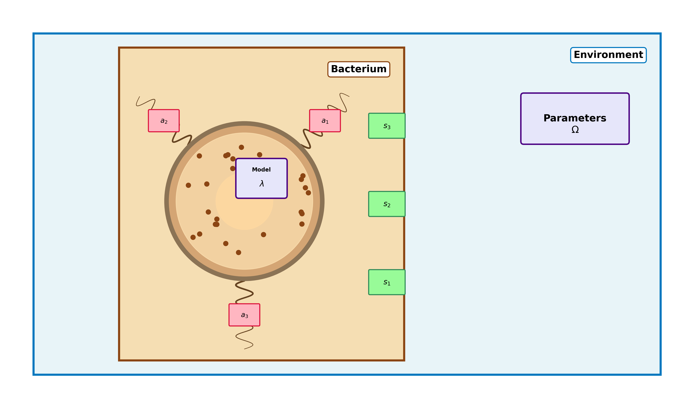

# Part B: How living things learn

**A possible theory**

---

## Agenda: Part B

- What is life?
- The Free Energy Principle
- How Do We Learn?
- Where Does This Matter?
- Future Directions.

Note: Part B contrasts strongly with the foundations from Part A, and is more speculative.

---

### Defintion of Life.

**Question:** How do we define what it is to be alive?

- M
- R
- S
- G
- R
- E
- N

Note: I am getting on a bit, but this was the mnemonic I was taught in school!

---

### Defintion of Life.

**Question:** How do we define what it is to be alive?

- Movement
- Respiration
- Sensitivity
- Growth
- Resproduction
- Excretion
- Nutrition

---

### Defintion of Life.

**Question:** Is this useful?

- Movement - plants, fungi, barnacles?
- Respiration - clostridium bacteria?
- Sensitivity - viruses?
- Growth
- Resproduction - worker ants, worker bees?
- Excretion
- Nutrition - mayflies?

---

### Better defintion?

A living thing is an object which *actively maintains* its *boundary* with its environment

**Key points:**
- Actively - it uses energy to do this.
- Boundary - a border we can draw that separates organism and environment. These interact only through *sensory* and *active* states through the boundary.

---

### Example: Bacterium

---

### Example: Bacterium

**What can it do!**
 - Process information from sensory states (nutrients, light etc.)
 - Perceptual inference (= learning!)
 - Take actions (move towards food)

 Question: How?!

---

### Example: Bacterium sensing food

---

### Example: Bacterium moving towards food

---

### Example: Bacterium building its own model

---

### How to set the model parameters $\lambda$ ?

*We need a new quantity to optimise*

 - Minimizing energy expenditure?
 - Maximise "utility" (Bentham, hedonic calculus)?
 - Minimize "surprisal"

---

### Surprisal ?

*We really want to make a system which is good at prediction*

 - We can measure how unlikely a new pattern of sensor data is.
L = - \ln \int $p(s, \theta | \alpha) d\theta $
 - Note that this depdends on $\alpha$, the action taken by the organism.
 - If we minimize this, we are reducing the likelihood that the organism is surprised!

Note: You might think that minimizing surprisal means that the organism will just avoid all environments where it doesn't have any experience.
This isn't possible - living things are at the mercy of their environment - they *have* to deal with unexpected things.

---

### Minimization flow

*Process is divided into **perception** and **action**.*

  graph LR
      subgraph ENV[Environment]
          Theta["θ (Unknown Causes)"] --> S["s (Sensory Inputs)"]
      end
      subgraph INF[Inference]
          S -->|"Perception"| LambdaOpt["λ = min(L) over λ"]
          LambdaOpt -->|"Action"| AlphaOpt["α = min(L) over α"]
      end
      AlphaOpt -->|"update beliefs"| Theta
      classDef envClass fill:#e3f2fd,stroke:#2196f3,stroke-width:2px
      classDef infClass fill:#fff3e0,stroke:#ff9800,stroke-width:2px
      class Theta,S envClass
      class LambdaOpt,AlphaOpt infClass

---

### Things to notice

- Direct coupling of action to perception (cf. AI models).
- "Perception" - builds an "accurate" model of the experienced world.
- "Action" - resamples the environment.
- The model contains the same informational hierarchy as the world!

---

### Free Stuff

1. Occam's razor.
2. Epistemic Foraging - reducing the expected future surprise.
3. The scientific method.

---

### *Why do we learn*?

- To explain what we see (tigers in the woods -> calculus).
- To maintain the future existence of humanity (technology)?
- To develop shared models of the world (reduce war).

---

### Why current AI alone can't teach?

1. No Prediction Error to Minimize
2. No Active Inference Loop
3. They Lack Generative Models of Causation
4. No Epistemic Drive
5. The Learner's Dilemma - Fluent exposure ≠ learning.
6. No Embodiment, No Grounding

---

### What to do instead?

 - Develop models of human cognition further.
 - Virtual tutors with surprisal from learner confusion.
 - Harness *intrinsic* motivation - easier isn't better.
 - Ask questions more than giving answers.

 **Reinforcement learning looks close, but still not quite right!**

---

## Summary: Parts A & B

**Part A - AI Foundations:**
- AI, ML, and Deep Learning hierarchy.
- Where modern AI is weak.
- There are some fixes, but the problem isn't well-posed.

---

## Summary: Parts A & B

**Part B - Natural Learning:**
- Living things maintain a boundary.
- Free energy principle - minimize surprisal.
- Model building, exploration vs exploitation.
- Occam's razor, the scientific method, how to teach.
- New paradigms.

You now have the foundations to revolutionize AI!

---

## Thank You!

### Questions & Discussion

**Stay Connected:**
- 📧 Email: [chrisjbpedder@hey.com]
- 💻 GitHub: [github.com/chrispedder/QMUL-Lecture]

Slides created with Reveal.js • Press 'S' for speaker notes • Press '?' for keyboard shortcuts

